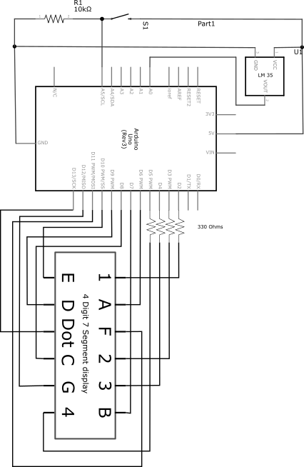
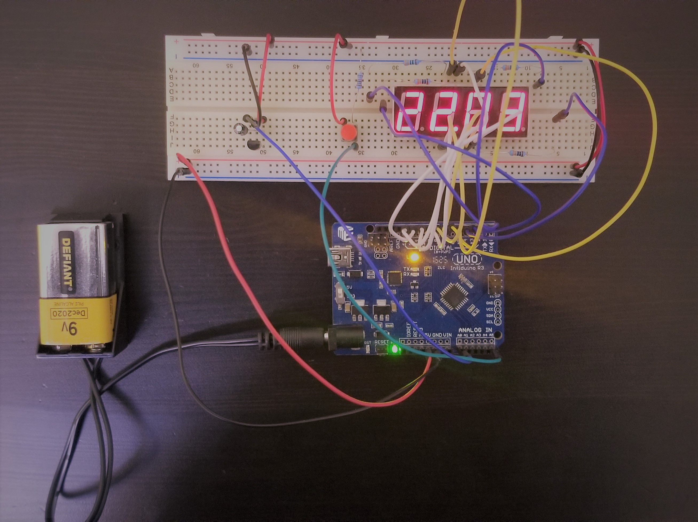

# Arduino Thermometer 

This project makes use of an Arduino Uno, a LM35 temperature sensor, and a 
four-digit 7-segment display in order to display the temperature of the surrounding environment.

### Circuit Diagram (Schematic) 

### Other Images 

### Notes 
This project was built as an example for the [FourSegDisplay Library](https://github.com/sshivam7/FourSegDisplay)

## Author 
Shivam Sood